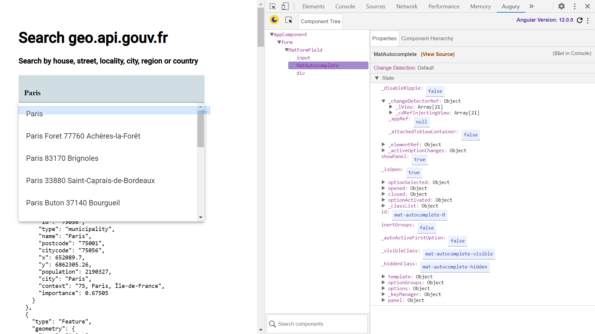

# :zap: Angular API Gouv.fr

* Angular app using an ngForm and RxJS operators and the [French Gouvernment API](https://geo.api.gouv.fr/) to search for addresses in France
* **Note:** to open web links in a new window use: _ctrl+click on link_


## :page_facing_up: Table of contents

* [:zap: Angular API Gouv.fr](#zap-angular-api-gouvfr)
  * [:page\_facing\_up: Table of contents](#page_facing_up-table-of-contents)
  * [:books: General info](#books-general-info)
  * [:camera: Screenshots](#camera-screenshots)
  * [:signal\_strength: Technologies](#signal_strength-technologies)
  * [:floppy\_disk: Setup](#floppy_disk-setup)
  * [:flashlight: Testing](#flashlight-testing)
  * [:computer: Code Examples](#computer-code-examples)
  * [:cool: Features](#cool-features)
  * [:clipboard: Status \& To-Do List](#clipboard-status--to-do-list)
  * [:clap: Inspiration](#clap-inspiration)
  * [:file\_folder: License](#file_folder-license)
  * [:envelope: Contact](#envelope-contact)

## :books: General info

* [API address search](https://geo.api.gouv.fr/adresse) uses the [geocoders geocodespec](https://github.com/geocoders/geocodejson-spec) standard geojson response format (6 years ago)
* RxJS subscriptions objects used to represents the execution of observables.

## :camera: Screenshots



## :signal_strength: Technologies

* [Angular v16](https://angular.io/)
* [Angular Material v16](https://material.angular.io/)
* [Angular Formcontrol](https://angular.io/api/forms/FormControl) used to track the value and validation status of an individual form control
* [Angular Material Autocomplete v16](https://material.angular.io/components/autocomplete/api)
* [SCSS](https://sass-lang.com/guide) extended CSS syntax using SASS pre-compiler
* [RxJS Library v7](https://angular.io/guide/rx-library) used to handle async operations using observables.
* [RxJS debounce time](https://rxjs-dev.firebaseapp.com/api/operators/debounceTime) added to user search to emit a value with a delay after user has stopped typing

## :floppy_disk: Setup

* Install dependencies by running `npm i`
* Run `ng serve` for a dev server. Navigate to `http://localhost:4200/`.
* The app will automatically reload if you change any of the source files

## :flashlight: Testing

* n/a

## :computer: Code Examples

* extract from `app.component.html` client form input field with autocomplete

```html
<form class="search-form-input">
  <mat-form-field class="search-full-width" appearance="fill">
    <input
      class="search-input"
      type="text"
      placeholder="Enter query"
      aria-label="query input field"
      matInput
      [formControl]="formControl"
      [matAutocomplete]="auto"
    />

    <!--autocomplete address using displayFctn to list options-->
    <mat-autocomplete #auto="matAutocomplete" [displayWith]="displayFctn">
      <mat-option *ngIf="isLoading" class="is-loading">
        <mat-progress-bar mode="query"></mat-progress-bar>
      </mat-option>
      <ng-container *ngIf="!isLoading">
        <mat-option *ngFor="let option of options" [value]="option">
          {{ displayFctn(option) }}
        </mat-option>
      </ng-container>
    </mat-autocomplete>
  </mat-form-field>
  </form>

```

## :cool: Features

* auto address complete
* No API key required
* Material module created and passed to modules that need it via the Shared module. The need for shared modules is debated and is set up here for the app to grow in size.

## :clipboard: Status & To-Do List

* Status: Simple Working address search. Only works with Ivy compiler disabled.
* To-Do: Nothing

## :clap: Inspiration

* [geo.api.gouv.fr homepage](https://geo.api.gouv.fr/) "Interrogez les référentiels géographiques plus facilement."
* [Geocoders: geocodejson-spec: Github repo](https://github.com/geocoders/geocodejson-spec) DRAFT: attempt to have standard geojson responses from geocoders.

## :file_folder: License

* This project is licensed under the terms of the MIT license.

## :envelope: Contact

* Repo created by [ABateman](https://github.com/AndrewJBateman), email: `gomezbateman@yahoo.com`
